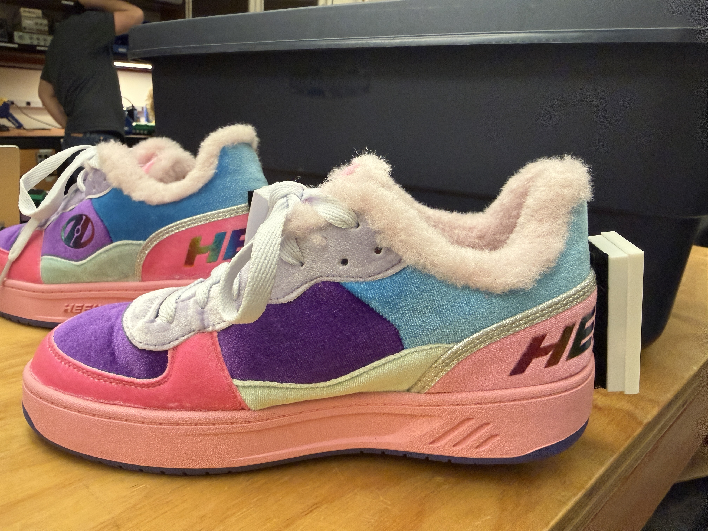

# Reelys

Reelys are a DIY sonified, light up heely shoe, designed from scratch as part of a capstone project for Stanford CCRMA's MUSIC250A: Physical Interaction Design for Music. 

## Hardware/Electronics
  * [Seeed XIAO nRF52840 Sense x2](https://www.seeedstudio.com/Seeed-XIAO-BLE-Sense-nRF52840-p-5253.html?srsltid=AfmBOooHCspDNu-aBo0t7IGdZl8osGEz4bAfPdIX-u2gH9hLNeErv5W-)
  * [Rechargeable Lithium Polymer Battery x2](https://ydlbattery.com/products/ydl-3-7v-150mah-352025-rechargeable-lipo-battery-with-jst-connector?currency=USD&country=US&variant=42093573898393&utm_source=google&utm_medium=cpc&utm_campaign=Google%20Shopping&stkn=a5847882d354&gad_source=1&gad_campaignid=17496818825&gbraid=0AAAAABXU5XFX8YsHwtyEQcUapKJj1gwH-&gclid=CjwKCAjwidXQBhAZEiwA4egw6I_fk3aA2wGGKMzpjCPC4mmHwymF3dYepuMpQYyx-4ausbMWo17mghoC_6oQAvD_BwE)
  * [Adapter Cables Polymer Battery x2](https://www.amazon.com/dp/B07NWD5NTN?ref=ppx_yo2ov_dt_b_fed_asin_title)
  * 1 pair of your favorite Heelys. I got [these](https://heelys.com/products/rezerve-low-neon-pink-violet-aruba?variant=45104283877527) since they were only 30 bucks on sale.
  * Casings for the chips + batteries to velcro to the back of the shoe. See `assembly/Reelys-Casing-Final.stl` for a 3D print you can use for this. 

## Software

This project uses Arduino code for obtaining IMU readings from the Seeed boards, and Max for doing sound synthesis. 

## Arduino and Python Libraries

**Board package** (install via Arduino IDE → Tools → Board → Boards Manager…):

  * **Seeed nRF52 Boards** — v1.1.12.
    To make the package available in Boards Manager, first add the index URL under **Arduino IDE → Settings → Additional boards manager URLs**:
    `https://files.seeedstudio.com/arduino/package_seeeduino_boards_index.json`

**Libraries** (install via Arduino IDE → Tools → Manage Libraries…):

  * **Seeed Arduino LSM6DS3** — v2.0.5. Driver for the onboard LSM6DS3TR-C IMU.
    https://github.com/Seeed-Studio/Seeed_Arduino_LSM6DS3
  * **MIDI Library** by Francois Best / lathoub — v5.0.2. Wraps Bluefruit's `BLEMidi` transport so the standard `MIDI.sendControlChange(...)` API works over BLE.

**Python (laptop side, debug listener only)** — pinned in `requirements.txt`:

  * **bleak** ≥0.21. If you are using `tools/ble_listener.py` to debug bluetooth connections to your Reelys, install with `pip install -r requirements.txt`.

## Usage

Flash both of your Seeed chips using `test_sketches/imu_ble_midi.ino`. Make sure that you change the 
shoe identity variable at the top of the file between flashes (1 for right shoe, 0 for left shoe).

Once you have your IMUs powered on and strapped to the back of the shoe, they should be recognizable
as `Reelys-L` and `Reelys-R` bluetooth MIDI devices. On Mac, you can connect to these devices using
the Audio Midi Setup app and opening up bluetooth connections in the MIDI Studio. 

Once your bluetooth connection is set up, you can launch the `max_patches/wee_oo.maxpat` patch and hear
sound from both shoes. You may need to recalibrate the patch to the orientation of your Seeed; mine is 
calibrated to changes in z acceleration. Feel free to create your own patches for customized sound design! 

To recharge your batteries, make sure they are connected to your Seeed chip and plug your Seeed chip
into your laptop via the USB-C connection.